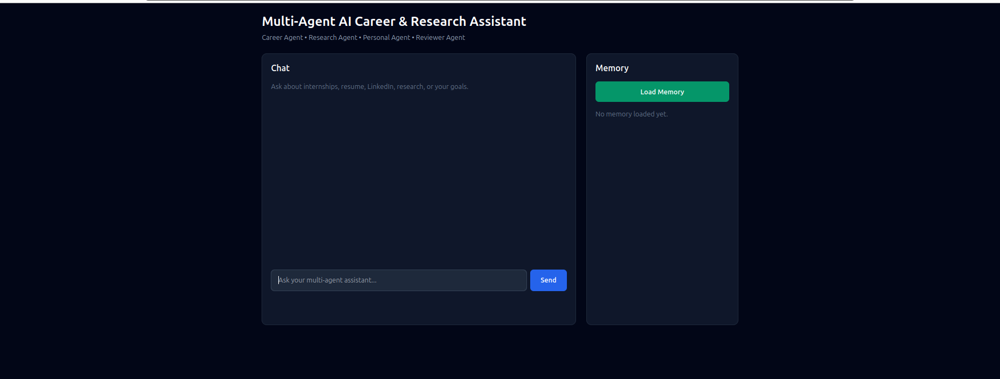
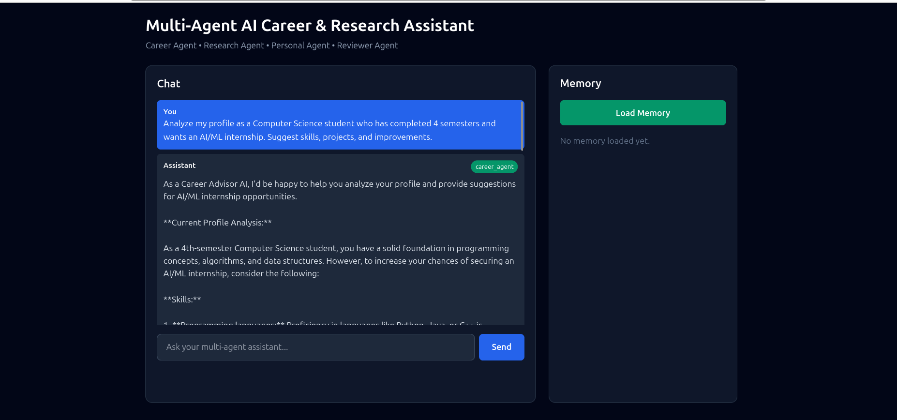
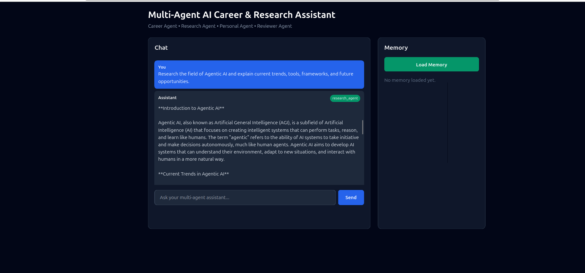
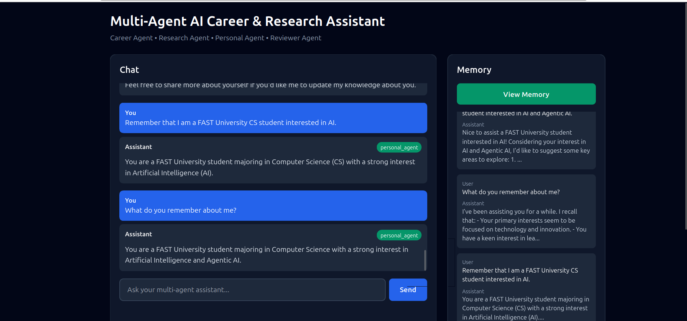

# Multi-Agent AI Career & Research Assistant

A full-stack multi-agent AI assistant that helps users with career guidance, research support, personal memory, resume improvement, LinkedIn advice, and AI learning roadmaps.

The system uses multiple specialized AI agents and routes user queries to the most suitable agent.

---

## Features

* Multi-agent routing system
* Career guidance agent
* Research assistant agent
* Personal assistant agent
* Reviewer agent
* Persistent memory system
* FastAPI backend
* React + Tailwind frontend
* Groq LLM integration
* Clean dashboard UI
* Memory panel
* Enter-to-send chat
* Auto-scroll chat
* Clear chat button
* Loading state

---

## Architecture

```text
User
 ↓
React Frontend
 ↓
FastAPI Backend
 ↓
Agent Router
 ↓
┌──────────────────┐
│ Career Agent     │
│ Research Agent   │
│ Personal Agent   │
│ Reviewer Agent   │
└──────────────────┘
 ↓
Memory System
 ↓
Groq LLM
 ↓
Final Response
```

---

## Tech Stack

### Frontend

* React
* Vite
* Tailwind CSS

### Backend

* FastAPI
* Python
* Groq API
* JSON-based memory storage

### Tools

* Git
* GitHub
* Ubuntu Terminal

---

## Project Structure

```text
multi-agent-ai-assistant/
│
├── backend/
│   ├── app/
│   │   ├── agents/
│   │   ├── memory/
│   │   ├── schemas/
│   │   ├── utils/
│   │   └── main.py
│   ├── requirements.txt
│   └── .env.example
│
├── frontend/
│   ├── src/
│   │   ├── services/
│   │   ├── App.jsx
│   │   └── main.jsx
│   └── package.json
│
├── docs/
├── screenshots/
├── README.md
└── .gitignore
```

---

## Agents

### Career Agent

Provides internship advice, skill roadmaps, resume suggestions, LinkedIn improvement tips, and career planning.

### Research Agent

Explains technical topics, researches AI trends, compares tools, and creates structured summaries.

### Personal Agent

Uses recent memory to personalize responses and remember useful user information.

### Reviewer Agent

Reviews responses and improves clarity, structure, and usefulness.

---

## Installation

### 1. Clone the Repository

```bash
git clone https://github.com/m-musif/Multi-Agent-AI-Career-Research-Assistant.git
cd Multi-Agent-AI-Career-Research-Assistant
```

---

## Backend Setup

```bash
cd backend
python3 -m venv venv
source venv/bin/activate
pip install -r requirements.txt
```

Create a `.env` file:

```env
GROQ_API_KEY=your_groq_api_key_here
```

Run backend:

```bash
uvicorn app.main:app --reload
```

Backend runs on:

```text
http://127.0.0.1:8000
```

---

## Frontend Setup

Open another terminal:

```bash
cd frontend
npm install
npm run dev
```

Frontend runs on:

```text
http://localhost:5173
```

---

## API Endpoints

```text
GET  /health
GET  /memory
POST /chat
```

---

## Screenshots

Add screenshots inside the `screenshots/` folder.

Recommended screenshots:

```text
screenshots/home-dashboard.png
screenshots/career-agent.png
screenshots/research-agent.png
screenshots/memory-agent.png
screenshots/multi-agent-roadmap.png
```

Example:

```md




```

---

## Example Prompts

```text
Create a 3-month roadmap to get an AI internship.
```

```text
Explain Agentic AI, LangGraph, CrewAI, and AutoGen in 5 bullet points.
```

```text
Remember that I am a FAST University CS student interested in AI.
```

```text
What do you remember about me?
```

---

## Future Improvements

* Add authentication
* Add database-based memory
* Add resume upload and analysis
* Add web search integration
* Add LangGraph workflow orchestration
* Add deployment with Docker
* Add chat history export

---

## Author

**Muhammad Musif**
Computer Science Student
FAST University
GitHub: [m-musif](https://github.com/m-musif)
